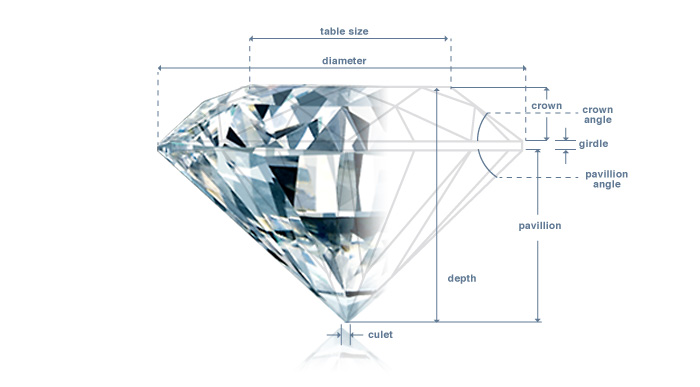
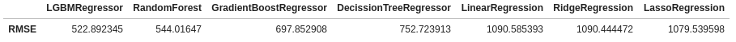

# Kaggle_Competition_ML

The objective of this project is to find the regression model that best estimates the price of a diamond based on the following characteristics:

- Carat: is the weight of the stone.
- Color: the degree of absence of color.
- Cut: the proportions of the diamond.
- Clarity: the presence or absence of inclusions in the diamond.
- Depth: height of the diamond.
- Table: width of the top face.
- x, y, z: dimensional metrics.

The dataset is made up of **40,455** entries that relates these characteristics and the price for these specific diamonds. The objective is to use machine learning models from SciKitLearn and Lightgmb to predict the price of another dataset where the price column is missig.

### :computer: **Technology stack**

    - Python
    - Pandas
    - Matplotlib
    - Seaborn
    - Numpy
    - Scikit-learn
    - Lightgbm

## **Analysis of the models**
In order to decide which model would be the best to solve this problem, I selected several models (LGBMRegressor, RandomForestRegressor, GradientBoostingRegressor,  DecisionTreeRegressor,
LinearRegression,  Ridge,  Lasso) to verify which one was the one with the best performance in terms of an error metric called ‘mean squared error’. These are the results:

Once analysed the results, the model chosen to solve the problem was LGBMRegressor as it was the most accurate model. In order to improve a little bit more the results, I used from the module of “·model selection” in Scikit-learn,  “ParameterGrid” and “RandomizedSearchCV” that allow to modify the hyperparameters of the model and improve the results and performance.
